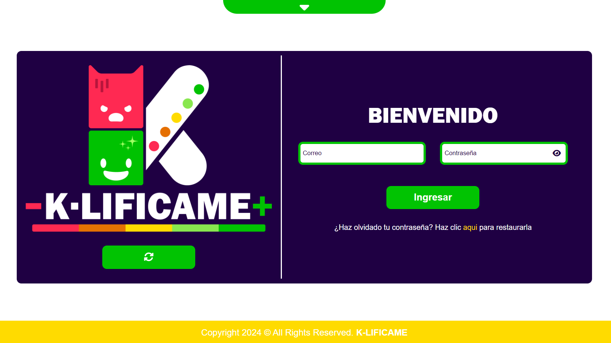
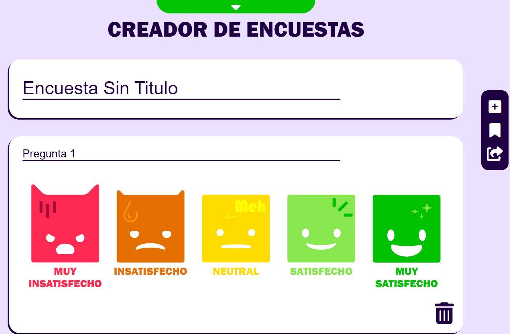
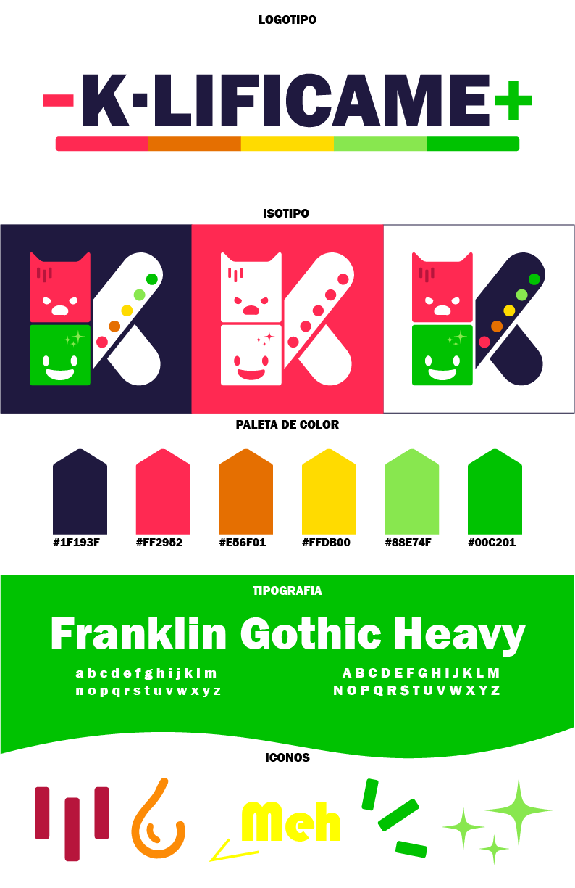
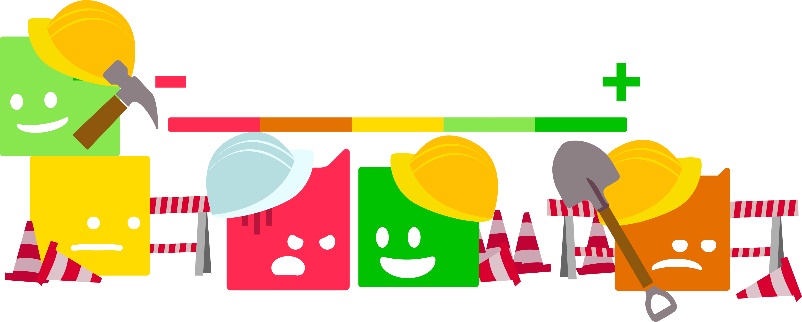

# 📊 K-LIFICAME — Sistema de Medición de Satisfacción

K-LIFICAME fue un proyecto experimental universitario orientado a la recopilación y análisis de métricas de satisfacción al cliente mediante dispositivos físicos basados en ESP32 y una plataforma web de visualización estadística.

El proyecto buscaba ofrecer a negocios una forma rápida e intuitiva de medir la percepción de atención al cliente utilizando la escala de Likert.

---

## 🧠 Concepto General

El sistema estaba compuesto por:

### 🔹 Dispositivo físico

Un módulo basado en ESP32 con botones físicos que permitía a los clientes calificar la atención recibida.

### 🔹 Plataforma web

Sistema encargado de:

- recibir información
- almacenar registros
- generar estadísticas
- mostrar gráficas de satisfacción
- visualizar métricas de atención

---

## ⚡ Funcionalidades principales

- Registro de calificaciones
- Dashboard administrativo
- Estadísticas de satisfacción
- Visualización gráfica de datos
- Métricas de atención al cliente
- Gestión básica de negocios

---

## 🧪 Funcionalidades experimentales

El proyecto contemplaba además módulos experimentales orientados a:

- creación de encuestas personalizadas
- ampliación de métricas
- personalización de formularios

Sin embargo, algunas de estas funcionalidades quedaron en fase de prototipo debido al contexto académico y alcance inicial del proyecto.

---

## 🛠️ Tecnologías utilizadas

### Frontend

- HTML5
- CSS3
- JavaScript

### Backend

- PHP

### Base de datos

- MySQL

### Hardware

- ESP32
- Arduino IDE

---

## 🎨 Diseño e identidad visual

Uno de los principales enfoques del proyecto fue desarrollar una identidad visual moderna y llamativa para facilitar la interacción con los usuarios y mejorar la experiencia general del sistema.

---

## 📌 Estado del proyecto

🟡 Proyecto experimental / académico  
🟡 Desarrollo discontinuado  
🟢 Conservado como parte de mi portafolio y evolución profesional

---

## 👨‍💻 Autor

Juan Pablo Barragán Bueno
